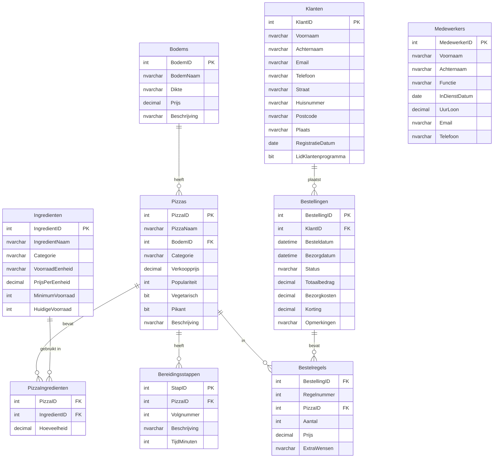

# Pizzafabriek Database

Een oefendatabase voor SQL Server om studenten te laten oefenen met SQL queries. TIP: om SQL te leren of uitgelegd te krijgen kijk je ook hier: https://www.w3schools.com/sql/default.asp

## Overzicht

Deze database simuleert een pizzafabriek met pizza's, ingrediënten, bestellingen, klanten en medewerkers.

## Entity Relationship Diagram (ERD)



## Database Structuur

### Tabellen

| Tabel | Beschrijving | Aantal Records |
|-------|--------------|----------------|
| **Bodems** | Verschillende pizza bodems | 6 |
| **Ingrediënten** | Alle beschikbare ingrediënten | 23 |
| **Pizzas** | Pizza menu items | 15 |
| **PizzaIngredienten** | Koppeltabel pizza ↔ ingrediënten | 75+ |
| **Bereidingsstappen** | Bereidingsinstructies per pizza | 14 |
| **Klanten** | Klantgegevens | 10 |
| **Bestellingen** | Klantbestellingen | 12 |
| **Bestelregels** | Individuele pizza's per bestelling | 21 |
| **Medewerkers** | Personeel | 8 |

### Views

- `vw_PizzaOverzicht` - Compleet overzicht van alle pizza's
- `vw_PizzaIngredienten` - Ingrediënten per pizza
- `vw_BestellingenOverzicht` - Bestellingen met klantgegevens
- `vw_VoorraadWaarschuwingen` - Ingrediënten met lage voorraad

### Stored Procedures

- `sp_NieuweBestelling` - Maak een nieuwe bestelling aan
- `sp_Populairstepizzas` - Haal de populairste pizza's op
- `sp_KlantLoyaliteit` - Bekijk klant statistieken

## Installatie

1. Open SQL Server Management Studio (SSMS)
2. Open het bestand `pizzafabriek.sql`
3. Voer het script uit (F5)
4. De database `Pizzafabriek` wordt aangemaakt en gevuld met data

## Voorbeeld Queries

### Basis SELECT queries

```sql
-- Alle pizza's tonen
SELECT * FROM Pizzas;

-- Vegetarische pizza's
SELECT * FROM vw_PizzaOverzicht WHERE Vegetarisch = 'Ja';

-- Pizza's goedkoper dan €10
SELECT PizzaNaam, Verkoopprijs 
FROM Pizzas 
WHERE Verkoopprijs < 10.00
ORDER BY Verkoopprijs;
```

### JOIN queries

```sql
-- Pizza's met hun ingrediënten
SELECT * FROM vw_PizzaIngredienten 
ORDER BY PizzaNaam;

-- Pizza's met hun bodem type
SELECT p.PizzaNaam, b.BodemNaam, b.Dikte, p.Verkoopprijs
FROM Pizzas p
INNER JOIN Bodems b ON p.BodemID = b.BodemID;

-- Klanten met hun bestellingen
SELECT 
    k.Voornaam + ' ' + k.Achternaam AS Klant,
    b.BestellingID,
    b.Besteldatum,
    b.Totaalbedrag,
    b.Status
FROM Klanten k
INNER JOIN Bestellingen b ON k.KlantID = b.KlantID
ORDER BY b.Besteldatum DESC;
```

### Aggregatie queries

```sql
-- Aantal pizza's per categorie
SELECT Categorie, COUNT(*) AS Aantal
FROM Pizzas
GROUP BY Categorie;

-- Gemiddelde prijs per pizza categorie
SELECT 
    Categorie, 
    AVG(Verkoopprijs) AS GemiddeldePrijs,
    MIN(Verkoopprijs) AS MinPrijs,
    MAX(Verkoopprijs) AS MaxPrijs
FROM Pizzas
GROUP BY Categorie;

-- Top 5 best verkochte pizza's
SELECT TOP 5
    p.PizzaNaam,
    SUM(br.Aantal) AS TotaalVerkocht,
    SUM(br.Aantal * br.Prijs) AS TotaleOmzet
FROM Pizzas p
INNER JOIN Bestelregels br ON p.PizzaID = br.PizzaID
GROUP BY p.PizzaID, p.PizzaNaam
ORDER BY TotaalVerkocht DESC;
```

### Subqueries

```sql
-- Pizza's duurder dan de gemiddelde prijs
SELECT PizzaNaam, Verkoopprijs
FROM Pizzas
WHERE Verkoopprijs > (SELECT AVG(Verkoopprijs) FROM Pizzas)
ORDER BY Verkoopprijs;

-- Klanten die nog nooit besteld hebben
SELECT Voornaam, Achternaam, Email
FROM Klanten
WHERE KlantID NOT IN (SELECT DISTINCT KlantID FROM Bestellingen);

-- Pizza's met meer dan 5 ingrediënten
SELECT p.PizzaNaam, COUNT(pi.IngredientID) AS AantalIngredienten
FROM Pizzas p
INNER JOIN PizzaIngredienten pi ON p.PizzaID = pi.PizzaID
GROUP BY p.PizzaID, p.PizzaNaam
HAVING COUNT(pi.IngredientID) > 5;
```

### UPDATE en DELETE

```sql
-- Voorraad bijwerken
UPDATE Ingredienten
SET HuidigeVoorraad = HuidigeVoorraad + 1000
WHERE IngredientNaam = 'Mozzarella';

-- Pizza prijs verhogen met 10%
UPDATE Pizzas
SET Verkoopprijs = Verkoopprijs * 1.10
WHERE Categorie = 'Speciaal';

-- Oude geannuleerde bestellingen verwijderen
DELETE FROM Bestellingen
WHERE Status = 'Geannuleerd' 
AND Besteldatum < DATEADD(MONTH, -6, GETDATE());
```

### Window Functions

```sql
-- Rangschikking pizza's per categorie op basis van prijs
SELECT 
    PizzaNaam,
    Categorie,
    Verkoopprijs,
    RANK() OVER (PARTITION BY Categorie ORDER BY Verkoopprijs DESC) AS PrijsRank
FROM Pizzas;

-- Lopend totaal van bestellingen per klant
SELECT 
    k.Voornaam + ' ' + k.Achternaam AS Klant,
    b.Besteldatum,
    b.Totaalbedrag,
    SUM(b.Totaalbedrag) OVER (PARTITION BY k.KlantID ORDER BY b.Besteldatum) AS LopendTotaal
FROM Klanten k
INNER JOIN Bestellingen b ON k.KlantID = b.KlantID;
```

### CTE (Common Table Expressions)

```sql
-- Pizza's met hun totale ingrediënt kosten
WITH PizzaKosten AS (
    SELECT 
        p.PizzaID,
        p.PizzaNaam,
        p.Verkoopprijs,
        SUM(pi.Hoeveelheid * i.PrijsPerEenheid) AS IngredientKosten
    FROM Pizzas p
    INNER JOIN PizzaIngredienten pi ON p.PizzaID = pi.PizzaID
    INNER JOIN Ingredienten i ON pi.IngredientID = i.IngredientID
    GROUP BY p.PizzaID, p.PizzaNaam, p.Verkoopprijs
)
SELECT 
    PizzaNaam,
    Verkoopprijs,
    IngredientKosten,
    (Verkoopprijs - IngredientKosten) AS Winstmarge,
    CAST(((Verkoopprijs - IngredientKosten) / Verkoopprijs * 100) AS DECIMAL(5,2)) AS WinstPercentage
FROM PizzaKosten
ORDER BY WinstPercentage DESC;
```

### Stored Procedures gebruiken

```sql
-- Top 10 populairste pizza's ophalen
EXEC sp_Populairstepizzas 10;

-- Klant loyaliteit bekijken
EXEC sp_KlantLoyaliteit @KlantID = 1;

-- Nieuwe bestelling aanmaken
DECLARE @NieuweBestellingID INT;
EXEC sp_NieuweBestelling 
    @KlantID = 1, 
    @Opmerkingen = 'Extra snel graag',
    @BestellingID = @NieuweBestellingID OUTPUT;
SELECT @NieuweBestellingID AS NieuweBestellingID;
```

## Oefenopgaven voor Studenten

### Beginner niveau

1. Toon alle pizza namen en prijzen, gesorteerd op prijs (laag naar hoog)
2. Tel hoeveel vegetarische pizza's er zijn
3. Toon alle klanten uit Amsterdam
4. Zoek alle ingrediënten in de categorie 'Kaas'
5. Toon de 5 duurste pizza's

### Intermediate niveau

6. Toon per pizza hoeveel ingrediënten erin zitten
7. Bereken de totale omzet per klant
8. Toon welke pizza's nooit besteld zijn
9. Maak een overzicht van bestellingen per maand
10. Toon ingrediënten die in meer dan 5 pizza's gebruikt worden

### Advanced niveau

11. Bereken de winstmarge per pizza (verkoopprijs - ingrediëntkosten)
12. Maak een ABC-analyse van pizza's op basis van omzet
13. Toon de groeitrend van bestellingen per week
14. Identificeer klanten die 'at risk' zijn (lang niet besteld)
15. Optimaliseer voorraad: voorspel benodigde ingrediënten voor volgende week

## Tips voor Docenten

- Start met eenvoudige SELECT queries op één tabel
- Oefen eerst met WHERE, ORDER BY, en basis aggregaties
- Introduceer JOINs geleidelijk (eerst INNER JOIN)
- Gebruik de views voor makkelijkere queries in het begin
- Laat studenten zelf queries schrijven voor realistische scenarios
- Laat studenten de stored procedures analyseren en verbeteren

## Data Model Kenmerken

- **Normalisatie**: Database is genormaliseerd (3NF)
- **Referentiële integriteit**: Foreign keys tussen alle gerelateerde tabellen
- **Data validatie**: CHECK constraints op velden zoals Status en Populariteit
- **Realistische data**: Fictieve maar realistische Nederlandse data
- **Many-to-many relatie**: PizzaIngredienten koppeltabel

## Licentie

Deze database is vrij te gebruiken voor educatieve doeleinden.

## Contact

Voor vragen of suggesties, neem contact op met de docent.